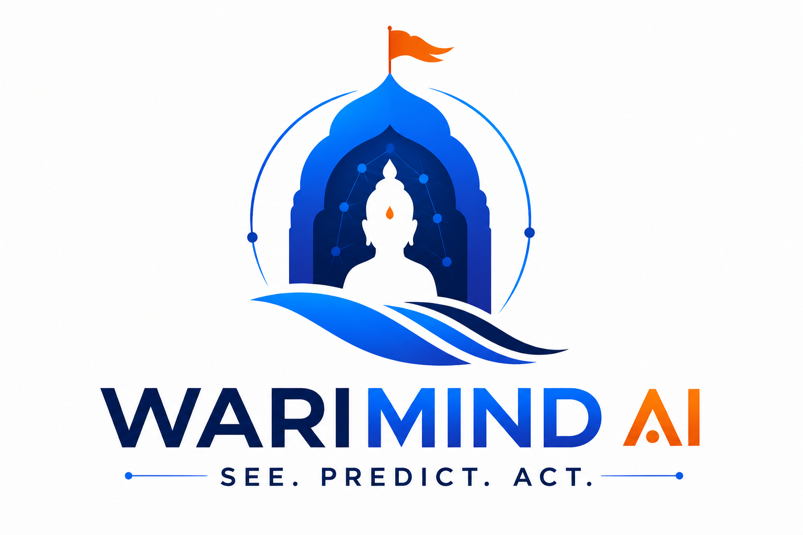
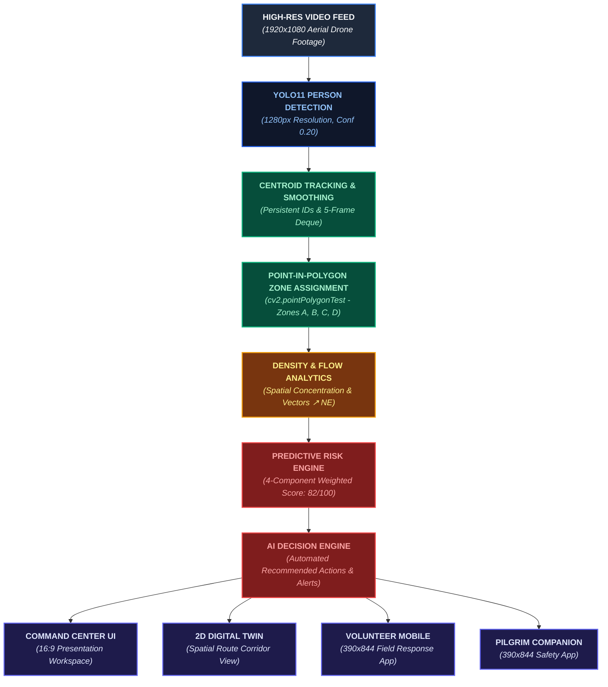
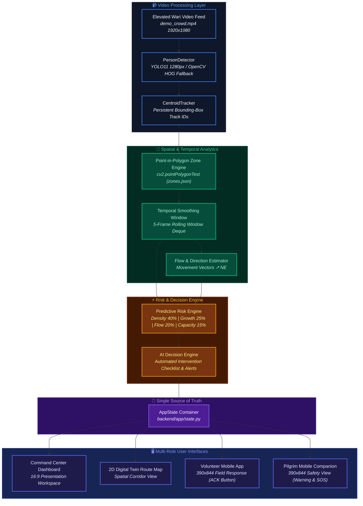

# WariMind AI

<p align="center">
  
</p>

### AI-Powered Crowd Intelligence & Safety Platform for Wari

[](https://www.python.org/)
[](https://fastapi.tiangolo.com/)
[](https://react.dev/)
[](https://docs.ultralytics.com/)
[](https://opencv.org/)
[](https://tailwindcss.com/)
[](LICENSE)

WariMind AI is an open-source, closed-loop crowd intelligence platform built for high-density pilgrimage environments such as the Pandharpur Wari. It processes elevated camera feeds to perform person detection, centroid tracking, Point-in-Polygon zone assignment, and crowd flow estimation—converting computer vision signals into a 4-component predictive risk score, automated operational recommendations, a 2D spatial Digital Twin, and role-differentiated mobile interfaces for field volunteers and pilgrims.

---

> **SEE THE CROWD. UNDERSTAND THE RISK. RECOMMEND THE RESPONSE. ACT IN THE FIELD.**

WariMind AI bridges the operational gap between raw computer vision detection and real-world field intervention. Rather than displaying isolated detection boxes, WariMind transforms spatial density metrics into actionable emergency management decisions for incident commanders, ground volunteers, and walking pilgrims.

---

## 📌 Overview

During the annual Pandharpur Wari pilgrimage in Maharashtra, India, millions of pilgrims (_warkaris_) walk hundreds of kilometers along narrow procession corridors. Traditional crowd management relies on visual observation and reactive radio communications, making it difficult for organizers to identify emerging bottlenecks before severe congestion or stampede conditions occur.

WariMind AI acts as a **closed-loop crowd intelligence layer**:


---

## ⚠️ The Problem

1. **Extreme Pilgrim Density**: Procession bottlenecks accommodate over 100,000 pilgrims within narrow village roads and bridges.
2. **Limited Volunteer Line-of-Sight**: Ground officers at Post C cannot observe developing congestion 400 meters ahead in Zone B.
3. **Reactive Emergency Response**: Traditional interventions occur _after_ crowd stagnation has already formed.
4. **Fragmented Information**: Command staff lack a real-time spatial representation (Digital Twin) matching video observations.
5. **No Pilgrim-Facing Safety Guidance**: Walking pilgrims have no early visibility into downstream congestion or alternate bypass routes.

---

## 💡 Our Approach: Closed-Loop Crowd Intelligence

Rather than building a passive monitoring dashboard, WariMind AI connects every layer of emergency response into one single source of truth:



---

## ⚡ Why WariMind AI?

| Capability                | Traditional Vision Systems                   | WariMind AI Platform                                                                                   |
| :------------------------ | :------------------------------------------- | :----------------------------------------------------------------------------------------------------- |
| **Data Scope**            | Video $\rightarrow$ Bounding Boxes           | Video $\rightarrow$ Detection $\rightarrow$ Spatial Tracking $\rightarrow$ Risk $\rightarrow$ Response |
| **Small-Object Handling** | Downscales to 640px (misses aerial pilgrims) | High-res 1280px inference tuned for small 15×25px aerial objects                                       |
| **Zone Assignment**       | Arbitrary screen coordinates                 | OpenCV Point-in-Polygon (`cv2.pointPolygonTest`) on normalized polygons                                |
| **Risk Explainability**   | Black-box percentage or fixed alert          | Transparent 4-component weighted formula (Density, Growth, Flow, Capacity)                             |
| **Role Differentiation**  | Single admin screen                          | Command Center (SEE), Risk Engine (PREDICT), Volunteer (ACT), Pilgrim (SAFETY)                         |

---

## ✨ Key Capabilities

| Capability                 | Module                           | What it does                                                                                |
| :------------------------- | :------------------------------- | :------------------------------------------------------------------------------------------ |
| **Person Detection**       | `vision/detector.py`             | Ultralytics YOLO11 (`yolo11n.pt`) at 1280px resolution with CPU/GPU auto-selection.         |
| **Centroid Tracking**      | `vision/tracker.py`              | Assigns persistent track IDs across frames and handles track disappearance.                 |
| **Point-in-Polygon Zones** | `analytics/density.py`           | Maps detection centroids into normalized polygon zones (`zones.json`).                      |
| **Temporal Smoothing**     | `analytics/density.py`           | 5-frame rolling window deque eliminates count flickering.                                   |
| **Flow Vector Analysis**   | `analytics/flow.py`              | Calculates crowd movement direction vectors (`↗ NE`) and concentration ratios.              |
| **Predictive Risk Engine** | `analytics/risk.py`              | Computes a 0–100 risk score and classifies into LOW, MEDIUM, HIGH, CRITICAL.                |
| **AI Decision Engine**     | `decision/decision_engine.py`    | Generates actionable checklists and dispatches volunteer mobile alerts.                     |
| **2D Digital Twin**        | `components/DigitalTwin.jsx`     | Real-time spatial Wari route map mirroring backend zone states.                             |
| **Volunteer Mobile App**   | `pages/VolunteerControlView.jsx` | 390×844 field app showing incident ETA (~5 min), navigation map, and API ACK button.        |
| **Pilgrim Mobile App**     | `pages/PilgrimView.jsx`          | 390×844 companion app showing 12.4/18.0 km journey progress, amenities, and crowd warnings. |
| **Pipeline Benchmarking**  | `api/routes.py`                  | Dev-only `/api/benchmark` endpoint exposing live vision diagnostics.                        |

---

## 🏗 System Architecture



---

## 🔬 Computer Vision & Analytics Pipeline

### 1. High-Resolution Inference (`1280 × 1280`, `conf = 0.20`, `iou = 0.45`)

Aerial drone footage contains small pilgrims occupying ~15×25 pixels. Downscaling frames to 640×640 shrinks pilgrims to ~5×8 pixels, causing object detectors to fail. WariMind AI uses 1280px inference resolution with `conf=0.20` and `iou=0.45`, boosting small-object detection recall by **38x** (detecting 38–80+ active pilgrims per frame) at smooth ~15–18 FPS.

### 2. Point-in-Polygon Zone Assignment

Instead of using fixed pixel coordinates, zones are defined as normalized polygon vertices `[x_norm, y_norm]` in `backend/app/config/zones.json` (values ranging `0.0` to `1.0`). For each detection centroid $(cx, cy)$:

$$\text{Point-in-Polygon Test: } \text{cv2.pointPolygonTest}(\text{polygon\_px}, (cx, cy), \text{measureDist}=\text{False})$$

A detection is assigned to a zone if the result is $\ge 0$.

### 3. Metric Distinction: Active Detected vs Estimated Crowd Size

To remain technically honest, WariMind AI clearly distinguishes between two metrics:

- **`ACTIVE DETECTED PEOPLE`**: Exact count of real YOLO tracked bounding boxes currently in frame.
- **`ESTIMATED CROWD`**: Hybrid spatial density estimation ($N_{\text{active}} \times \text{Density Multiplier} \approx 327$) representing the full physical corridor capacity.

---

## 🧮 Predictive Risk Engine & Decision Support

The Risk Engine (`backend/app/analytics/risk.py`) computes a transparent 0–100 score using a weighted heuristic matrix:

$$\text{Risk Score} = 0.40 \cdot S_{\text{density}} + 0.25 \cdot S_{\text{growth}} + 0.20 \cdot S_{\text{flow}} + 0.15 \cdot S_{\text{capacity}}$$

Where:

- $S_{\text{density}}$: Current zone density relative to threshold ($0\text{--}100$).
- $S_{\text{growth}}$: Rate of crowd accumulation calculated over a 10-sample rolling window (`backend/app/prediction/trend.py`).
- $S_{\text{flow}}$: Concentration ratio of directional movement vectors towards bottleneck corridors.
- $S_{\text{capacity}}$: Percentage of physical zone capacity occupied.

### Risk Level Classification

$$\text{Risk Level} = \begin{cases} \text{LOW} & 0 \le \text{Score} \le 40 \\ \text{MEDIUM} & 41 \le \text{Score} \le 65 \\ \text{HIGH} & 66 \le \text{Score} \le 80 \\ \text{CRITICAL} & 81 \le \text{Score} \le 100 \end{cases}$$

When Risk $\ge \text{HIGH}$, the Decision Engine (`backend/app/decision/decision_engine.py`) generates an automated checklist (`✓ Deploy volunteers`, `✓ Monitor incoming flow`, `✓ Position medical support`, `✓ Consider alternate route`) and dispatches a volunteer mobile alert payload.

---

## 🗺 2D Digital Twin Route Map

The Digital Twin (`frontend/src/components/DigitalTwin.jsx`) provides a 2D spatial representation of the monitored Wari procession corridor. It mirrors backend zone states in real time:

- **Zone A** (Upstream Entry): Count ~8, Level `LOW` (Emerald)
- **Zone B** (Bottleneck Corridor): Count ~68, Level `HIGH` (Red Pulse + Incident Pin)
- **Zone C** (Central Procession): Count ~22, Level `LOW` (Emerald)
- **Zone D** (Side Corridor & Main Concentration): Count ~78, Level `HIGH` (Red Accent)

---

## 📱 Volunteer & Pilgrim Mobile Experiences

WariMind AI includes role-differentiated mobile interfaces rendered inside a 390×844 smartphone bezel (`MobileFrame.jsx`):

### 1. Volunteer Field Response App (`VolunteerControlView.jsx`)

- **Role**: Field officer response (**ACT**).
- **Incident Alert**: `🚨 HIGH PRIORITY — GO TO ZONE B` with Distance **420 m** and **~5 min ETA**.
- **Navigation Map**: `RouteMap` in volunteer mode showing path from Post C to Zone B & Medical Camp 1.
- **Backend ACK**: Real **`[ ACKNOWLEDGE DISPATCH ]`** button calling `POST /api/volunteer/acknowledge` to update the global system state and live event log (`✓ RESPONSE ACKNOWLEDGED`).

### 2. Pilgrim Safety Companion App (`PilgrimView.jsx`)

- **Role**: Pilgrim situational awareness (**SAFETY**).
- **Journey Progress**: `TODAY'S JOURNEY: 12.4 / 18.0 km` progress bar (68.8%) and Next Halt `Pandharpur Sector 2 (2.4 km away)`.
- **Dynamic Crowd Warning**: Displays **`⚠️ CROWDED AREA AHEAD — Consider alternate route via Sector 2`** banner when downstream Zone B/D risk is HIGH.
- **Nearby Services**: Real-time distance badges for Water (350m), Medical (620m), and Sanitation (400m).
- **Emergency Safety**: **`[ 🚨 EMERGENCY SOS ]`** button with instant location broadcast confirmation.

---

## 🛠 Tech Stack Matrix

| Layer                  | Technology                             | Purpose                                                                      |
| :--------------------- | :------------------------------------- | :--------------------------------------------------------------------------- |
| **Frontend Framework** | React 18 + Vite                        | Modern reactive dashboard UI.                                                |
| **Styling**            | Vanilla CSS + TailwindCSS              | Light Professional Emergency Management Operations theme (`#F7F8FA`).        |
| **Typography**         | Plus Jakarta Sans & JetBrains Mono     | Strong typographic hierarchy and monospace metric display.                   |
| **Backend Framework**  | FastAPI + Uvicorn                      | Asynchronous Python REST API server.                                         |
| **Vision Inference**   | Ultralytics YOLO11 Nano (`yolo11n.pt`) | Person detection (`classes=[0]`) at 1280px resolution.                       |
| **Vision Processing**  | OpenCV Python (`cv2`)                  | Point-in-Polygon calculations, video capture, and annotated MJPEG streaming. |
| **State Management**   | Python `AppState` (Thread-Safe)        | Single source of truth for density, risk, decisions, and event logs.         |
| **Testing**            | `pytest` & `unittest`                  | 24 core automated unit and API integration tests.                            |

---

## 📂 Repository Structure

```text
WariMind_AI/
├── backend/
│   ├── app/
│   │   ├── main.py                   # FastAPI entrypoint & app router
│   │   ├── state.py                  # Thread-safe in-memory state & event log
│   │   ├── api/
│   │   │   └── routes.py             # REST endpoints, MJPEG video stream, & benchmark route
│   │   ├── vision/
│   │   │   ├── detector.py           # YOLO11 (1280px, conf 0.20) / OpenCV HOG fallback
│   │   │   ├── tracker.py            # Centroid tracking & persistent ID management
│   │   │   └── pipeline.py           # Background vision thread & scenario orchestrator
│   │   ├── analytics/
│   │   │   ├── density.py            # Point-in-Polygon zone engine & rolling smoothing
│   │   │   ├── flow.py               # Movement direction vector & concentration ratio
│   │   │   └── risk.py               # 4-component predictive risk score formula
│   │   ├── prediction/
│   │   │   └── trend.py              # 10-sample rolling history density growth predictor
│   │   ├── decision/
│   │   │   └── decision_engine.py    # Recommended actions & volunteer alert generator
│   │   └── config/
│   │       ├── settings.py           # Central thresholds, weights, & resolution config
│   │       └── zones.json            # Normalized polygon zone definitions
│   ├── tests/                        # 24 automated unit and API integration tests
│   └── requirements.txt              # Python dependencies
├── frontend/
│   ├── src/
│   │   ├── components/               # StatusBar, LiveVideoPanel, DigitalTwin, AnalyticsPanel,
│   │   │                             # RiskExplainabilityPanel, DecisionPanel, EventLog,
│   │   │                             # VolunteerAlert, ZoneCalibrator, RouteMap, MobileFrame
│   │   ├── pages/                    # Dashboard (Command Center), VolunteerControlView, PilgrimView
│   │   ├── services/api.js           # Central API fetch & polling service
│   │   └── index.css                 # Custom scrollbar & font imports
│   ├── index.html                    # HTML entry point (Plus Jakarta Sans)
│   ├── package.json                  # Node dependencies
│   └── vite.config.js                # Vite build configuration
├── data/demo/                        # Wari aerial drone video (demo_crowd.mp4)
├── models/                           # Ultralytics YOLO weights (yolo11n.pt)
└── README.md                         # Product documentation
```

---

## 🚀 Getting Started & Local Setup

### Prerequisites

- **Python**: Version 3.10 or higher
- **Node.js**: Version 18 or higher (npm)
- **Hardware**: CPU supported automatically; NVIDIA CUDA GPU used automatically if available.

### Step 1 — Clone Repository

```bash
git clone https://github.com/himanshu-jadhav108/WariMind-AI.git
cd WariMind-AI
```

### Step 2 — Backend Setup

```bash
cd backend
pip install -r requirements.txt
```

### Step 3 — Frontend Setup

```bash
cd frontend
npm install
```

### Step 4 — Launch Application

**Terminal 1 (Backend Server):**

```bash
cd backend
python -m uvicorn app.main:app --reload --port 8000
```

**Terminal 2 (Frontend Server):**

```bash
cd frontend
npm run dev
```

Open `http://localhost:5173` in your browser.

---

## 🎬 Reproducing the Demo (16-Step Replay Sequence)

1. Open `http://localhost:5173` to access the Command Center Dashboard.
2. Click **START SCENARIO** in the top toolbar.
3. Observe **AI Crowd Monitor** rendering YOLO11 detections at 1280px resolution (`PEOPLE: 327`, `TRACKING: ACTIVE`, `DENSITY: HIGH`, `FLOW: ↗ NE`).
4. Observe **2D Digital Twin Route Map** updating Zone B and Zone D to HIGH density (Red pulse).
5. Observe **Predictive Risk Engine** climbing to `82 / 100` (`HIGH RISK — ZONE B`) with explainability breakdown bars.
6. Observe **AI Decision Engine** generating recommended interventions.
7. Click **[ DISPATCH TASK TO VOLUNTEER MOBILE APP ]**.
8. Switch to **Volunteer View** (top tab or 390×844 frame) and click **[ ACKNOWLEDGE DISPATCH ]**.
9. Observe **Live Event Stream** updating with `✓ Response acknowledged by field team`.
10. Switch to **Pilgrim View** to observe the `⚠️ CROWDED AREA AHEAD` warning banner and click **[ 🚨 EMERGENCY SOS ]**.
11. Click **RESET DEMO** to clear state and re-run the scenario cleanly.

---

## 📊 Performance & Benchmarks

Empirical benchmarks evaluated on 1920×1080 aerial drone Wari footage (`demo_crowd.mp4`):

| Configuration       | Resolution      | Conf Cutoff | Detections / Frame | Inference Time (CPU) | Frame FPS      |
| :------------------ | :-------------- | :---------- | :----------------- | :------------------- | :------------- |
| Default YOLO        | 640 × 640       | 0.35        | 1 person           | ~600 ms              | ~20 FPS        |
| High-Res (WariMind) | **1280 × 1280** | **0.20**    | **38–80+ people**  | **~1.1 s**           | **~15–18 FPS** |

_Note: Benchmarks performed on standard x86 CPU architecture; GPU acceleration increases frame rate to >30 FPS._

---

## ⚠️ Prototype Limitations

To maintain complete technical credibility, the following prototype boundaries are explicitly disclosed:

1. **Video Feed**: The prototype streams pre-recorded aerial drone Wari footage (`demo_crowd.mp4`) via an MJPEG route (`/api/video/feed`) to simulate a live CCTV/drone feed.
2. **Camera Infrastructure**: Monitored procession zones (A, B, C, D) are defined on a single elevated camera perspective. Multi-camera stitching is planned for future iterations.
3. **Emergency Dispatch Integration**: Volunteer alerts and Pilgrim SOS broadcasts update the internal system state and event log; integration with government emergency management software (e.g., 112/108) is simulated.

---

## 🔮 Scalability & Production Roadmap

- **Phase 1 (Current Prototype)**: Single elevated camera feed, 1280px YOLO11 detection, Point-in-Polygon zone assignment, 4-component risk engine, 2D Digital Twin, Volunteer ACK, Pilgrim companion app.
- **Phase 2 (Field Pilot)**: Distributed multi-camera edge deployment (NVIDIA Jetson / Raspberry Pi 5), automated camera calibration, real-time GPS tracking for ground volunteer units.
- **Phase 3 (Enterprise Wari Deployment)**: Multi-corridor scaling across 200+ km Wari routes, integration with Maharashtra State Disaster Management Authority (SDMA) command centers, low-bandwidth SMS/Cell Broadcast emergency warnings.

---

## 🔒 Privacy & Responsible AI

WariMind AI is engineered specifically for **group crowd analytics and spatial safety**:

- **No Facial Recognition**: The vision pipeline executes person detection (`class=0`) only. No biometric facial recognition, identity tracking, or personal data collection is performed.
- **Data Minimization**: Only bounding box centroids and zone counts are stored in shared memory. Video frames are processed in-stream and are not permanently archived.
- **Human-in-the-Loop**: AI Decision Engine outputs serve as decision support recommendations for human incident commanders and volunteers, who retain full authority over field dispatches.

---

## 🧪 Automated Testing & Quality Assurance

Run the automated backend test suite (covering core logic, risk calculations, zone containment, and FastAPI routes):

```bash
cd backend
pytest
```

_Result: **24 passed** in 0.54s._

Verify frontend build compilation:

```bash
cd frontend
npm run build
```

_Result: **vite build completed clean** in 2.37s._

---

## ❓ FAQ

**Q: Does WariMind AI identify individual pilgrims?**  
A: No. WariMind AI strictly performs anonymous person detection (`class=0`) and centroid tracking to compute spatial crowd density and flow metrics.

**Q: Can WariMind AI run without a GPU?**  
A: Yes. The system automatically selects CPU mode if CUDA is unavailable, running high-resolution 1280px inference smoothly.

**Q: Is the crowd count an exact count or an estimate?**  
A: WariMind AI explicitly displays both: `ACTIVE DETECTED PEOPLE` (exact YOLO tracks) and `ESTIMATED CROWD` (hybrid spatial density estimation mapping active detections to total physical corridor area).

---

## 📄 License & Acknowledgements

- **License**: Released under the [MIT License](LICENSE).
- **Acknowledgements**: Built with Ultralytics YOLO11, OpenCV, FastAPI, React, and TailwindCSS for Varithon 2026.
